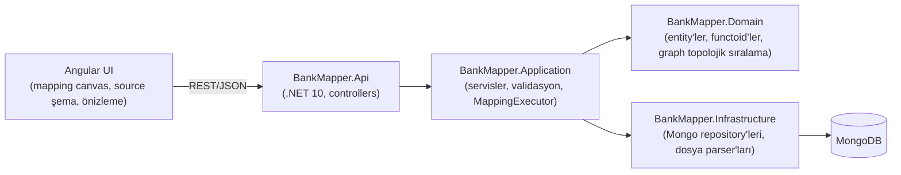
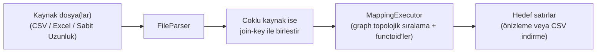

# Bank Mapper

Banka/finans dosya formatları (CSV, Excel, sabit uzunluklu metin) arasında görsel, graph tabanlı bir eşleme (mapping) aracı. Bir kaynak dosyayı belirli bir hedef dosya formatına, functoid'ler (Trim, LPad, RPad, Concat, Upper, Lower) ve sabit değerlerle dönüştürerek eşlemeyi ve önizlemeyi/dönüştürmeyi sağlar.

## Teknoloji yığını

- **Frontend**: Angular 22 (standalone components, signals), mapping canvas için AntV X6
- **Backend**: .NET 10 Web API, katmanlı mimari (Domain / Application / Infrastructure / Api)
- **Veritabanı**: MongoDB
- **Loglama**: Serilog (konsol + günlük rotasyonlu JSON dosya sink'i)

## Mimari



### Mapping çalıştırma akışı



Bir mapping; kaynak şema referansları, functoid node'ları, sabit değer node'ları ve bunları birbirine (ve hedef alanlara) bağlayan kenarlardan (edge) oluşan bir graph olarak saklanır. `MappingExecutor` bu graph'ı topolojik sıraya göre çalıştırıp her satır için hedef alanları üretir.

## Çalıştırma

Backend, MongoDB'nin `localhost:27017`'de çalışıyor olmasını bekler (bağlantı ayarı `backend/BankMapper.Api/appsettings.json` içinde `MongoDbSettings`).

```bash
cd backend/BankMapper.Api
dotnet run
```

```bash
cd frontend
npm install
npm start
```

Frontend varsayılan olarak `http://localhost:4200`, backend `http://localhost:5299` üzerinde çalışır (bkz. `frontend/src/environments/environment.ts`).

## Test

```bash
cd backend
dotnet test
```

```bash
cd frontend
npx ng test --watch=false
```

## Sağlık kontrolü

Backend ayaktayken `GET /health` MongoDB bağlantısının durumunu döner.
